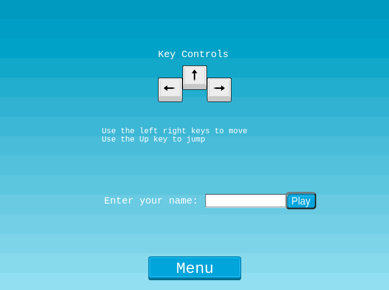
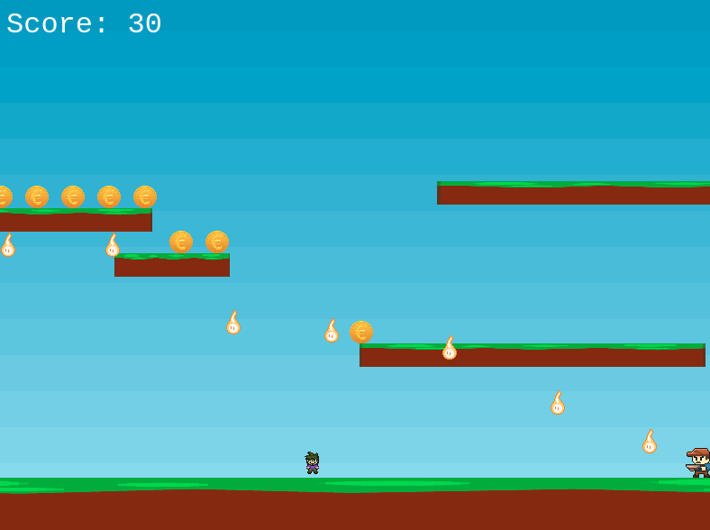

# STAR-FALL

This project is an RPG game built with Phaser 3, a JavaScript game framework designed to create 2D games. The user can collect coins which depicts star live to get score , without touching the bullets fired.

## Game Design Documentation

The Star-fall design process started with the idea of creating a simple and beautiful RPG.
I got inspired by the RPG classic the supermario. Thanks to opengameart.org for posting all of these amazing sprites and tiles used in the game.
 
I started by creating a platform game, with a movable character on a static window, that can jump and collect entities.
 
The game’s entire map was built with Tiled on a 32 x 32 collection other than the cowboy that was built on 45 x 44 of squares.
 
First I created player and coins to get scores, then I added the bullet so the player will have some obstacles to run from.
 
Every player has to choose a name and submit your score at the end of the game for it to display on the leaderboard.


## Live Demo

[Link here](https://goofy-wright-45a581.netlify.app/)

## ScreenShoot




## Built With

- JavaScript
- ESLint
- Phaser 3
- Jest
- Webpack
- Leaderboard API service


## Prerequisites

You must have a browser on your PC in order to use the application. [Click here](https://www.mozilla.org/en-US/firefox/new/) to download one.


## How To Play
You can control the player using a mouse and a keyboard.

To move the player:
- PRESS "Left arrow key" to move Left
- PRESS "Right arrow key" to move Right
- PRESS "Up arrow key" to Jump


## Getting Started

To get a copy up and running follow these simple example steps:-

```bash
# Clone this repository
$ git clone https://github.com/Godswilly/star-fall.git

# Go into the repository
$ cd star-fall

$ Run: npm install
$ Run: npm run start

```

## Testing
To test the project:

```bash
$ Open the Terminal
$ cd star-fall to enter directory
$ npm run test to start testing
$ All tests will pass ✅

```

## Author

👤 **Kalu Agu Kalu**

- [Github](https://github.com/Godswilly)
- [Twitter](https://twitter.com/KaluAguKalu17)
- [Linkedin](https://www.linkedin.com/in/kalu-agu-kalu/)

## 🤝 Contributing

Contributions, issues and feature requests are welcome!

Feel free to check the <a href="https://github.com/Godswilly/star-fall/issues" target="_blank">issues page</a>.

## Show your support

Give a ⭐️ if you like this project!

## Acknowledgments

- <a href="https://www.theodinproject.com/" target="_blank">The Odin Project</a>

- <a href="https://www.opengameart.org" target="_blank">Opengameart</a>
